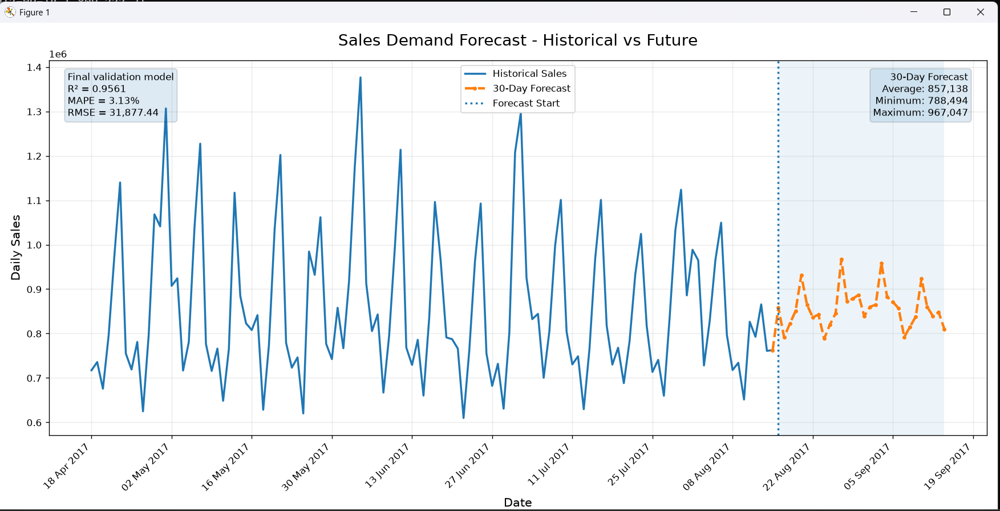
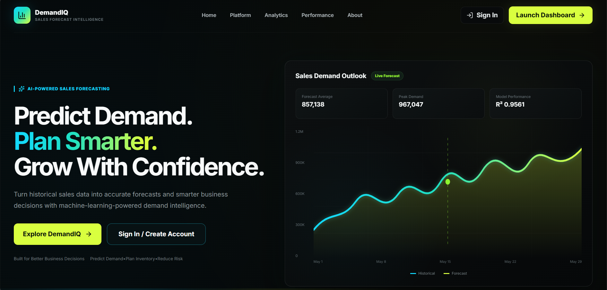
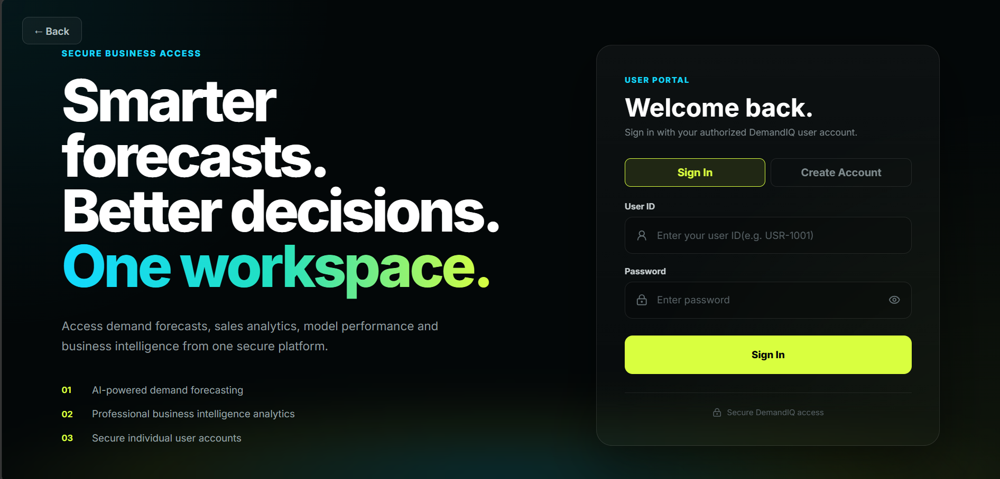
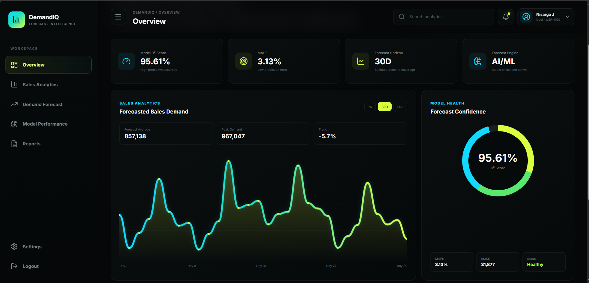
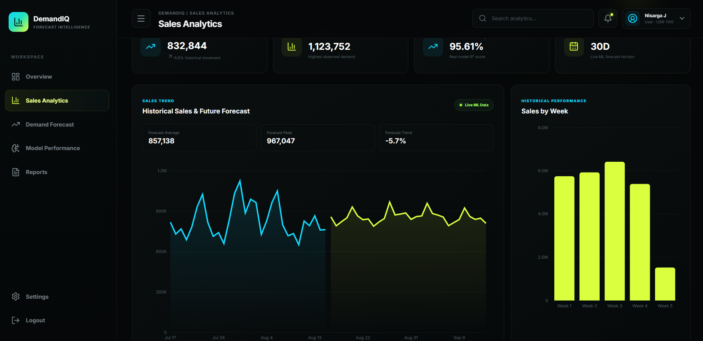
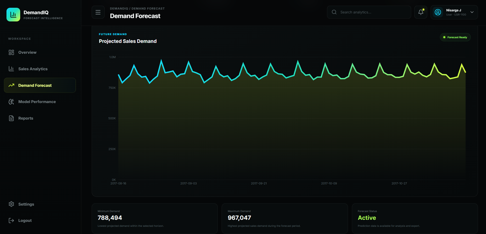
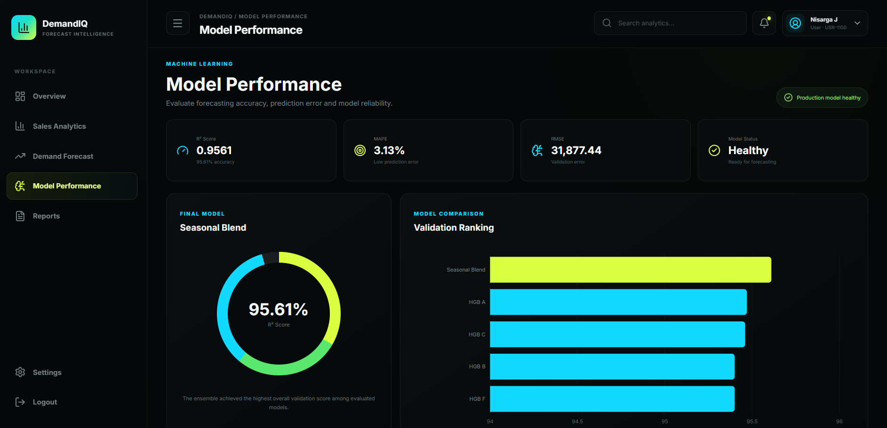
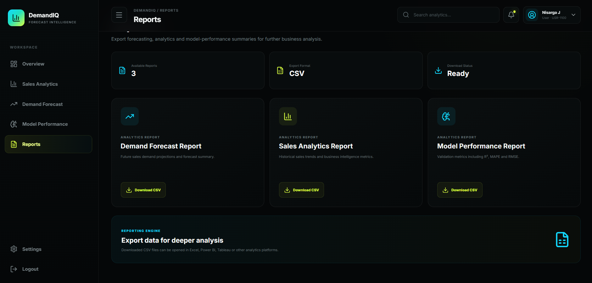

# FUTURE_ML_01 — DemandIQ

## Sales Demand Forecasting & Business Analytics Platform

DemandIQ is an end-to-end machine learning application designed to forecast future sales demand and transform forecasting results into clear, actionable business insights.

The project combines a machine-learning forecasting pipeline, FastAPI backend, React frontend, historical sales analytics, model-performance monitoring, authentication, and downloadable reports in a single application.

## Internship Task information

This project was developed as part of the **Future Interns Machine Learning internship**.

> **Organization:** Future Interns
> **Internship Task:** FUTURE_ML_01  
> **Track:** Machine Learning  
> **Project:** Sales Demand Forecasting  
> **Status:** Completed

---

## 🌐 Live Deployment

### Live Application
https://futureml01.vercel.app/

### Backend API
https://future-ml-01-m3gs.onrender.com

### API Health Check
https://future-ml-01-m3gs.onrender.com/api/health

> The backend is hosted on Render's free tier. The first request after a period of inactivity may take approximately 30–60 seconds while the service wakes up.

---

## Project Overview

Businesses need reliable demand estimates to plan inventory, understand sales trends, reduce uncertainty, and make better operational decisions.

DemandIQ addresses this problem by analyzing historical sales data and generating future demand forecasts for multiple forecasting horizons.

The application supports:

- 7-day demand forecasting
- 30-day demand forecasting
- 90-day demand forecasting
- Historical sales analytics
- Interactive forecast visualization
- Model-performance monitoring
- Forecast report generation
- CSV report downloads
- User authentication and account creation

---

## Key Features

### Demand Forecasting

DemandIQ generates future sales forecasts for:

- **7 Days**
- **30 Days**
- **90 Days**

Forecasts are generated using the trained machine-learning forecasting pipeline.

### Interactive Dashboard

The dashboard provides a high-level overview of:

- Forecasted sales demand
- Average demand
- Peak demand
- Minimum demand
- Demand trend
- R² score
- MAPE
- RMSE
- Model health

### Sales Analytics

The Sales Analytics module provides visual analysis of historical and forecasted demand, helping users understand sales behavior and future trends.

### Model Performance

The application provides dedicated model-performance monitoring using:

- R² Score
- Mean Absolute Percentage Error (MAPE)
- Root Mean Squared Error (RMSE)
- Mean Absolute Error (MAE)

### Reports

DemandIQ provides forecasting summaries and downloadable CSV reports for further analysis.

### Authentication

The application includes a SQLite-based authentication system with:

- User sign-in
- Account creation
- Password hashing
- User profile information
- User status
- Logout functionality

---

## Machine Learning Model

DemandIQ uses an ensemble forecasting approach implemented with Scikit-learn.

The final forecasting system combines three `HistGradientBoostingRegressor` models.

Future demand is generated recursively using historical and derived forecasting features.

### Model Performance

| Metric | Result |
| --- | ---: |
| R² Score | **95.61%** |
| MAPE | **3.13%** |
| RMSE | **31,877** |
| MAE | **23,465** |
| Validation Period | **60 Days** |

The final model achieved an R² score of **0.9561**, indicating strong predictive performance on the validation period.

## Forecast Visualization

Matplotlib was used during the machine learning analysis and evaluation stage to visualize historical sales alongside the model's future demand predictions.

The visualization below compares historical daily sales with the generated 30-day demand forecast and highlights the beginning of the forecast period.



### Forecast Summary

- **R² Score:** 0.9561
- **MAPE:** 3.13%
- **RMSE:** 31,877.44
- **30-Day Forecast Average:** 857,138
- **Minimum Forecast:** 788,494
- **Maximum Forecast:** 967,047

The deployed DemandIQ application presents these forecasting results through its own interactive React-based business dashboard, while Matplotlib was used for model analysis and standalone forecast visualization.

---
## Business Interpretation of the Forecast

### What Does the Forecast Mean?

DemandIQ predicts the expected future sales demand based on historical sales patterns, trends, seasonality, and time-based features.

The forecast helps estimate how much demand a business can expect over upcoming days. Users can view different forecast horizons such as 7, 30, and 90 days to understand both short-term and longer-term demand patterns.

Higher predicted values indicate periods where stronger customer demand is expected, while lower predicted values indicate periods of relatively lower demand.

### How Can a Business Use the Forecast?

Businesses can use these predictions to make better planning decisions, including:

- **Inventory Planning:** Maintain sufficient stock during predicted high-demand periods and reduce excess inventory during lower-demand periods.
- **Staffing:** Schedule additional employees when higher sales activity is expected.
- **Purchasing:** Plan supplier orders based on anticipated future demand.
- **Budgeting:** Use expected sales patterns to support financial and operational planning.
- **Promotions:** Identify lower-demand periods where marketing campaigns or promotions may be useful.
- **Resource Allocation:** Prepare business resources in advance for expected peaks and changes in demand.

DemandIQ transforms the model's predictions into business-friendly visualizations so that store owners, startup founders, and business managers can use the forecast for practical decision-making.

---

## Application Screenshots

### Landing Page



### Sign In



### Dashboard Overview



### Sales Analytics



### Demand Forecast



### Model Performance



### Reports



---

## Technology Stack

### Frontend

- React
- Vite
- JavaScript
- CSS
- Recharts
- Lucide React
- React Router

### Backend

- Python
- FastAPI
- Uvicorn
- SQLite

### Machine Learning & Data

- Scikit-learn
- Pandas
- NumPy
- Joblib

### Development Tools

- Visual Studio Code
- Git
- GitHub

---

## Project Architecture

```text
Historical Sales Data
        │
        ▼
Data Cleaning & Processing
        │
        ▼
Feature Engineering
        │
        ▼
ML Model Training
        │
        ▼
HistGradientBoosting Ensemble
        │
        ▼
Recursive Demand Forecasting
        │
        ▼
FastAPI Backend
        │
        ▼
React Frontend
        │
        ├── Dashboard
        ├── Sales Analytics
        ├── Demand Forecast
        ├── Model Performance
        └── Reports
```

---

## Project Structure

```text
FUTURE_ML_01/
│
├── backend/
│   ├── database.py
│   ├── demandiq.db
│   ├── main.py
│   ├── model_service.py
│   └── requirements.txt
│
├── data/
│   ├── processed/
│   │   └── daily_sales.csv
│   └── raw/
│
├── frontend/
│   ├── public/
│   ├── src/
│   │   ├── assets/
│   │   ├── components/
│   │   ├── pages/
│   │   ├── services/
│   │   ├── App.jsx
│   │   └── main.jsx
│   ├── package.json
│   └── vite.config.js
│
├── models/
│   └── final_sales_forecasting_model.joblib
│
├── outputs/
│   ├── forecasts/
│   ├── metrics/
│   └── plots/
│
├── screenshots/
│
├── src/
│   ├── clean_data.py
│   ├── forecast.py
│   ├── train_model.py
│   └── visualize_forecast.py
│
├── .gitignore
├── README.md
└── requirements.txt
```

> The original raw training CSV is excluded from the Git repository because it exceeds GitHub's standard individual-file size limit. The processed dataset required by the application is included.

---

## Installation

### 1. Clone the Repository

```bash
git clone https://github.com/nisarga-4/FUTURE_ML_01.git
cd FUTURE_ML_01
```

### 2. Install Backend Dependencies

```bash
cd backend
pip install -r requirements.txt
```

### 3. Start the FastAPI Backend

```bash
python -m uvicorn main:app --reload
```

The backend runs locally on port `8000`.

FastAPI interactive API documentation is available at:

```text
http://127.0.0.1:8000/docs
```

### 4. Install Frontend Dependencies

Open another terminal:

```bash
cd frontend
npm install
```

### 5. Start the React Frontend

```bash
npm run dev
```

Open the local URL displayed by Vite in your browser.

---

## API Endpoints

| Method | Endpoint | Purpose |
| --- | --- | --- |
| GET | `/api/health` | Backend health check |
| GET | `/api/dashboard` | Dashboard and forecast summary |
| GET | `/api/forecast` | Future demand forecast |
| GET | `/api/historical` | Historical sales information |
| GET | `/api/model/metrics` | ML model evaluation metrics |
| POST | `/api/login` | User authentication |
| POST | `/api/users` | User account creation |

---

## Application Modules

DemandIQ consists of the following primary modules:

1. Landing Page
2. Sign In / Create Account
3. Dashboard Overview
4. Sales Analytics
5. Demand Forecast
6. Model Performance
7. Reports
8. Settings

---

## Forecasting Workflow

```text
Historical Sales Data
        ↓
Data Processing
        ↓
Feature Engineering
        ↓
Model Training
        ↓
Ensemble Forecasting Model
        ↓
Recursive Future Prediction
        ↓
FastAPI Services
        ↓
React Dashboard
        ↓
Analytics & Reports
```

---

## Business Value

DemandIQ is designed to help businesses:

- Predict future sales demand
- Understand historical sales behavior
- Identify demand trends
- Improve inventory planning
- Reduce stock-related uncertainty
- Monitor forecasting accuracy
- Convert ML predictions into understandable business insights

---

## Future Improvements

Potential enhancements include:

- Real-time sales data integration
- Automated model retraining
- Product-level demand forecasting
- Store-level demand forecasting
- Cloud-based persistent authentication
- Advanced inventory recommendations
- Forecast alerts and notifications
- Automated anomaly detection
- Production-scale model monitoring

---

## Repository Information

This repository was created according to the Machine Learning internship task submission format.

**Repository:** `FUTURE_ML_01`

**Task:** Sales Demand Forecasting

**Track:** Machine Learning

---

## Project Status

**Completed**

The project includes a functioning machine-learning forecasting pipeline, trained forecasting model, FastAPI backend, SQLite authentication system, React frontend, analytics dashboard, forecast visualization, model-performance monitoring, downloadable reports, and project documentation.

---

## Author

Developed by **Nisarga J** as part of a **Future Interns  Machine Learning internship**

---

## License

This project is intended for educational and internship evaluation purposes.